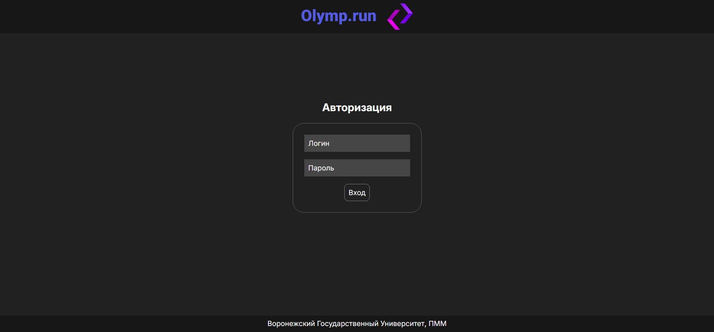
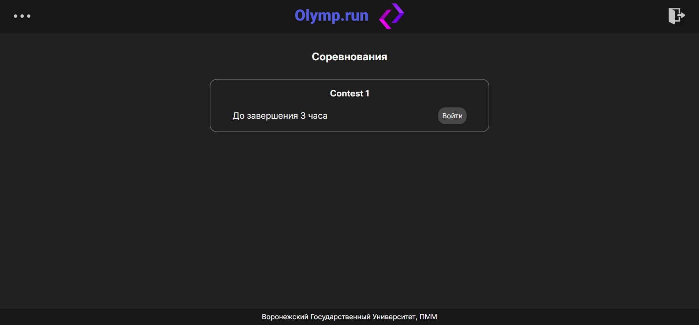
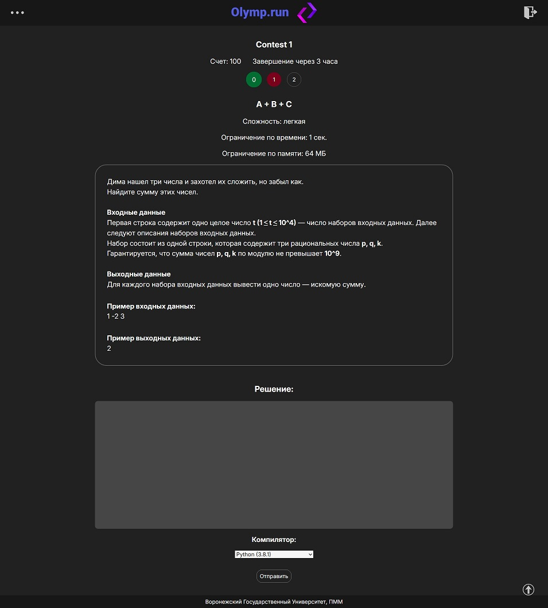
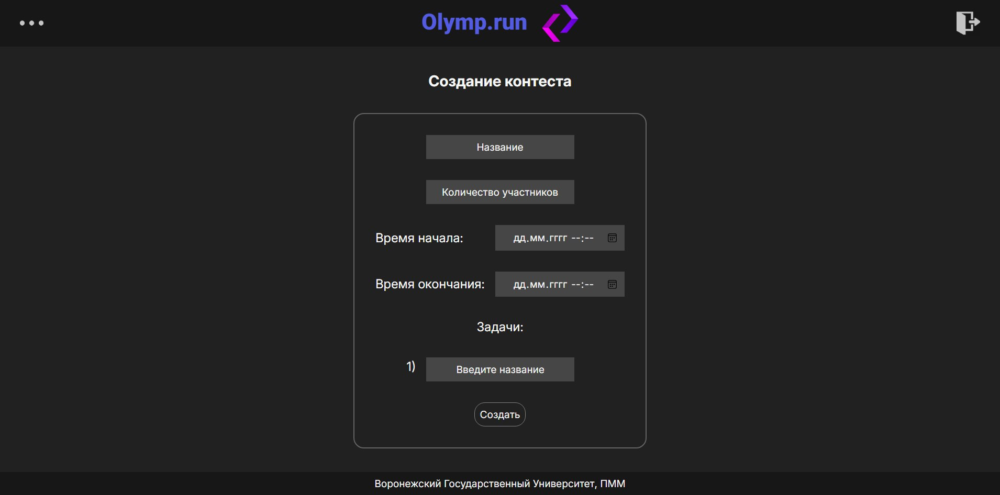
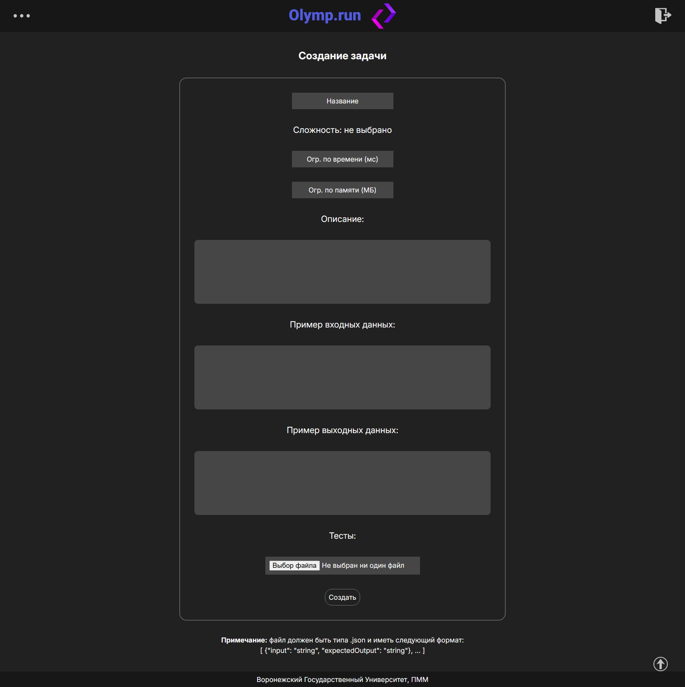
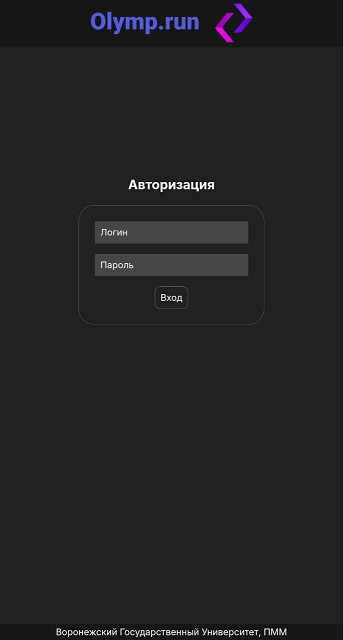
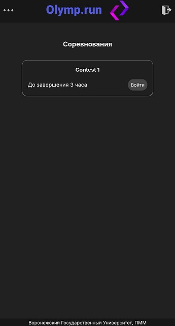
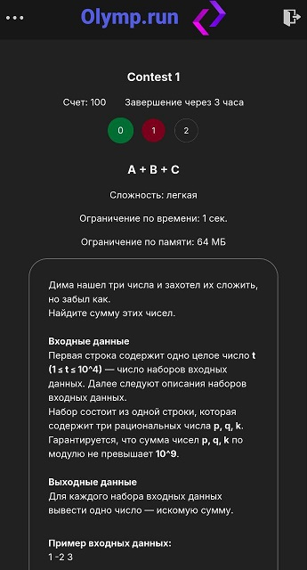
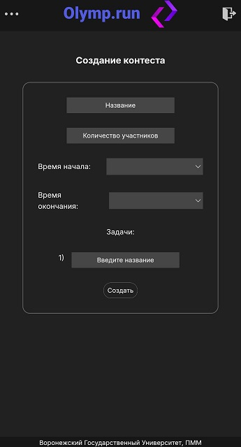
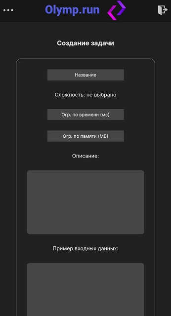

# About

## English
**Olymp.run** is a fullstack web application for organizing competitive programming olympiads. The application can be deployed in a container or on a hosting platform.  
  
## Русский
**Olymp.run** — это полнофункциональное веб-приложение для проведения олимпиад по спортивному программированию. Приложение может быть развернуто в контейнере или на хостинговой платформе.  
  
# Features

## English
The application provides the following features: administrator registration (via Postman), task and olympiad creation (via the admin panel), solution submission and evaluation, and management of tasks, users, and contests (via Postman).  

## Русский
Приложение предоставляет следующие функции: регистрация администратора (через Postman), создание заданий и олимпиад (через админ-панель), отправка и проверка решений, а также управление заданиями, пользователями и соревнованиями (через Postman).  
  
# Get Started

## English
You will need to generate `CRYPT_IV` in **hex format** with a length of **16** and `CRYPT_KEY` in **hex format** with a length of **32**.  
You will need to create a **login** and **password** for the database. 
  
And after that rename **.env.example** to **.env**  
  
**Command to rebuild from root directory:**  
`docker-compose down; docker volume rm olymprun_frontend_build; docker-compose up --build`  

## Русский
Вам необходимо сгенерировать `CRYPT_IV` в **hex-формате** длиной **16** и `CRYPT_KEY` в **hex-формате** длиной **32**.  
Также потребуется создать **логин** и **пароль** для базы данных.  
  
После этого переименуйте **.env.example** в **.env**.  
  
**Команда для пересборки из корневой директории:**  
`docker-compose down; docker volume rm olymprun_frontend_build; docker-compose up --build`  
  
# Screenshots

## Desktop  

### Login page

  
### Main page

  
### Contest page

  
### Contest creation page

  
### Task creation page

## Mobile  

### Login page

  
### Main page

  
### Contest page

  
### Contest creation page

  
### Task creation page

